# RayForge: C++ Ray Tracing Engine

RayForge is a C++14 ray tracing engine that parses custom `.ray` scene files and renders physically-inspired images with recursive lighting effects.  
The project focuses on core rendering systems: geometric intersections, scene-graph composition, multiple light models, material response, reflections/refractions, texture mapping, and acceleration via bounding boxes.

## What This Project Does

- Builds full scenes from a directive-based scene description format (`#camera`, `#light_*`, `#shape_*`, `#ray_file`, `#static_affine`, etc.).
- Supports multiple primitives and composite geometry:
  - `sphere`, `triangle`, `cone`, `cylinder`, `torus`, `box`
  - scene composition via `union`, `intersection`, `difference`
  - file instancing and affine transforms
- Implements three light types:
  - point lights (distance attenuation)
  - directional lights (parallel, no attenuation)
  - spot lights (distance + angular falloff with cutoff)
- Uses material terms for emissive/ambient/diffuse/specular/transparent response.
- Performs recursive ray tracing with:
  - specular reflection
  - refraction (index of refraction support)
  - cut-off thresholds for recursion control
- Tracks ray tracing performance statistics:
  - total rays
  - primitive intersections
  - bounding-box intersections

## Rendering Pipeline

1. Parse `.ray` scene directives into global scene data (camera, shader, lights) and local geometry/material/texture data.
2. Initialize scene graph nodes and material/texture references.
3. For each pixel, generate a camera ray using perspective projection.
4. Intersect against scene geometry and compute closest valid hit.
5. Shade hit point with light contributions:
   - ambient term
   - diffuse term
   - specular term
   - transparency along shadow rays
6. Recurse for reflected and refracted rays until depth/cutoff limits are reached.
7. Write final RGB output to image.

## Implemented Components

The project extends the provided framework by completing core `.todo.cpp` tasks across:

- `camera.todo.cpp`: perspective ray generation (`getRay`)
- `triangle.todo.cpp`: triangle intersection + barycentric handling + bounds
- `pointLight.todo.cpp`: ambient/diffuse/specular, shadowing, transparency
- `directionalLight.todo.cpp`: directional light shading/shadow/transparency
- `spotLight.todo.cpp`: cone-limited light with angular falloff
- `cone.todo.cpp`: cone intersection + bounds
- `cylinder.todo.cpp`: cylinder body/cap intersection + bounds + inside test
- `torus.todo.cpp`: torus intersection approximation + bounds + inside test
- `scene.todo.cpp`: reflection, refraction, recursive color evaluation

## Build and Run

### Requirements

- CMake (3.10+)
- C++14 compiler (`clang++`/`g++`)
- OpenGL + GLUT
- JPEG library

### Build

```bash
cmake -S . -B build
cmake --build build -j
```

### Run

```bash
./build/Bin/Assignment2 --in "test.point.ray" --out "output_point.bmp"
```

Useful flags:

- `--width` (default: `640`)
- `--height` (default: `480`)
- `--rLimit` (default: `5`)
- `--cutOff` (default: `0.0001`)

## Scene Inputs and Assets

- Scene files: `test.*.ray`, `creative*.ray`, `art_submission*.ray`, model scenes like `dog.ray`, `dragon.ray`, `buddha.ray`
- Textures/assets: `checker.jpg`, `funtex8.jpg`, `unsplash*.jpg`
- Extended summary source: `submission_summary.html`

## Results Gallery

### Lighting and Baseline Validation

**Point Light**

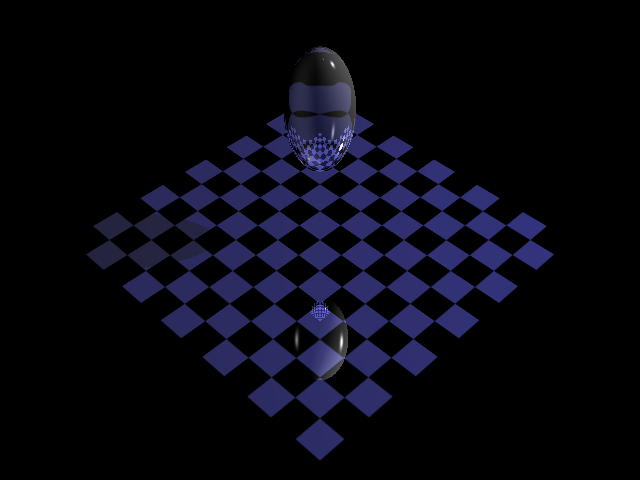

**Directional Light**


**Spot Light**

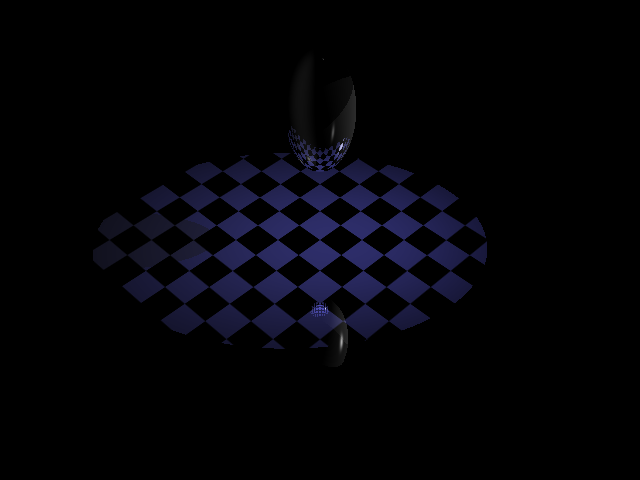

### Primitive and Geometry Validation

**Cone**

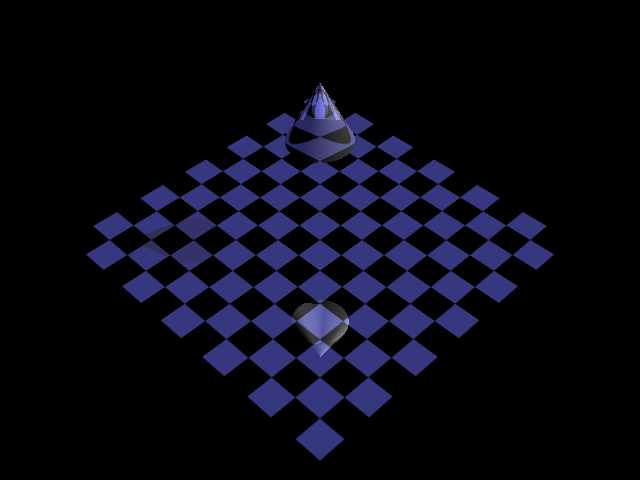

**Cylinder**

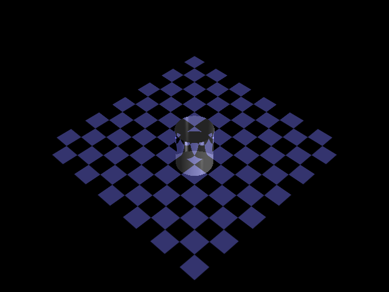

**General Test**

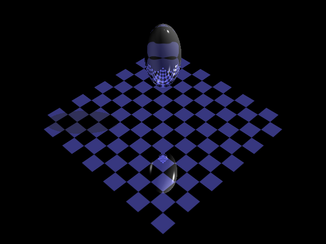

### Creative / Extended Scenes

**Creative Scene**

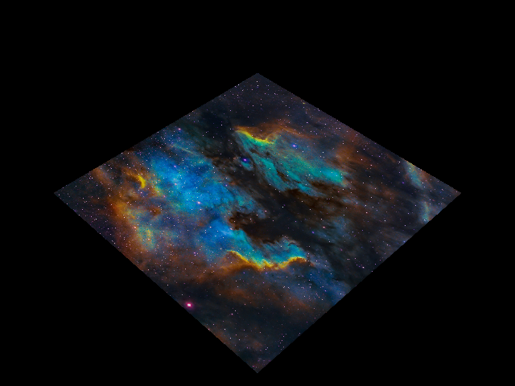

**Creative Scene 2**


**Creative Scene 3**

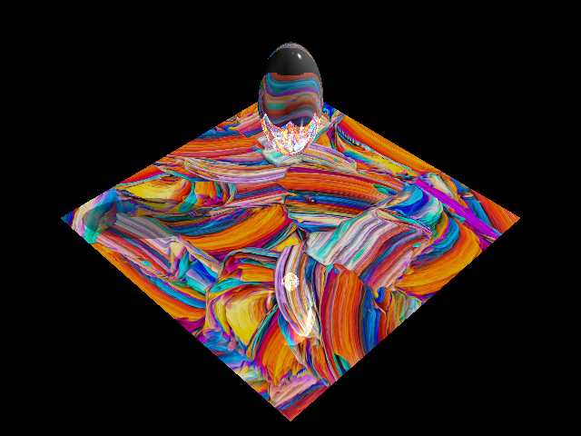

### Model-Based Scenes

**Dog**

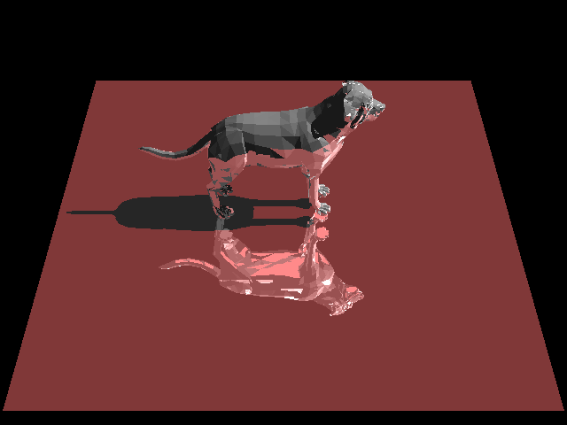

**Dragon**

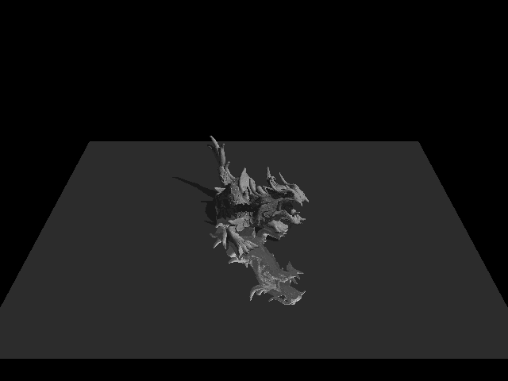

**David**

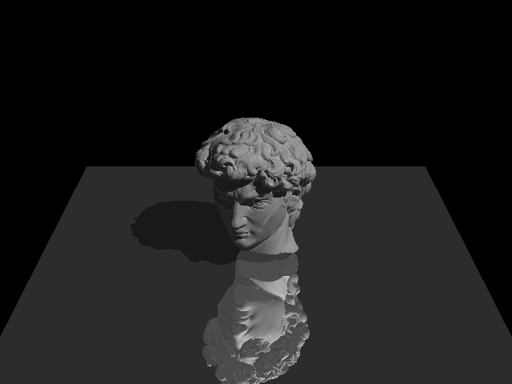

**Gargoyle Output**

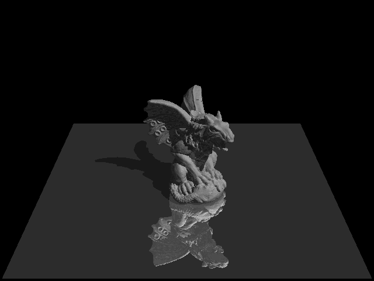

**Nefertiti Output**


### Art Submission Renders

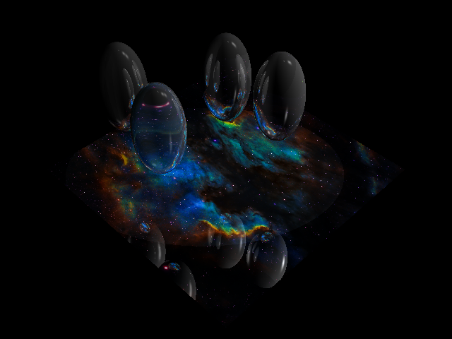
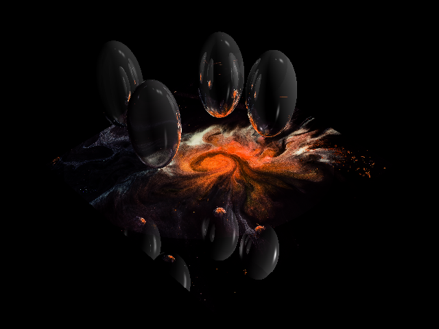
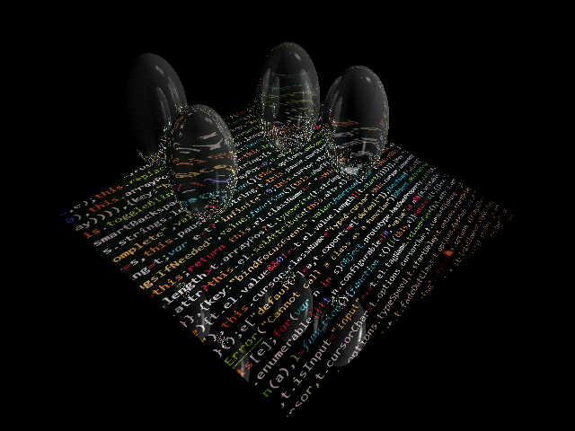
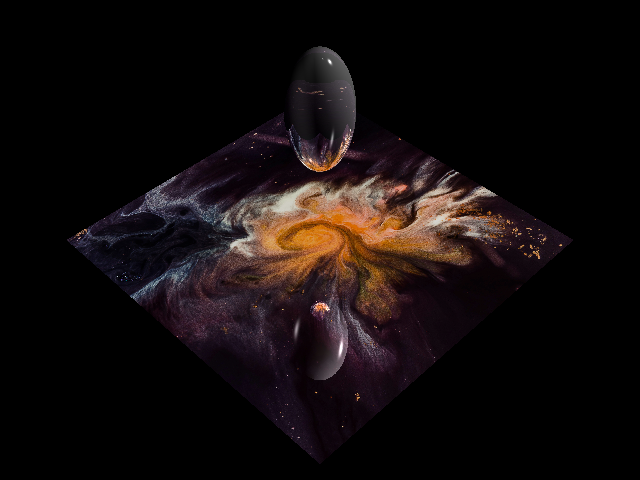
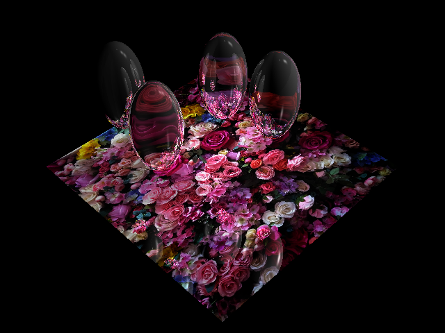
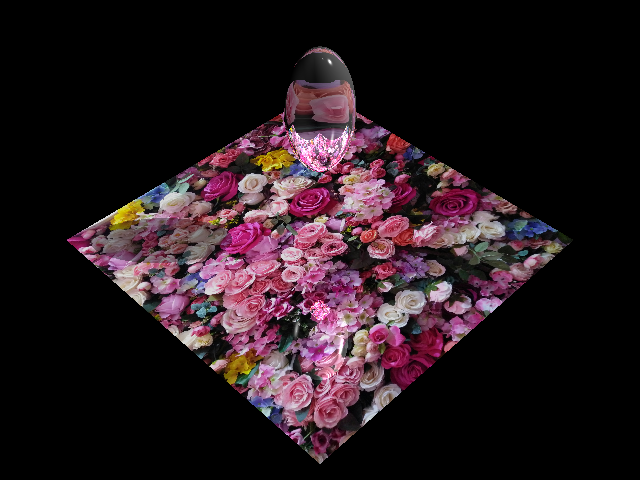

## Notes

- `gargoyle.ray` and `nefertiti.ray` source scene files are excluded from git because they exceed GitHub's 100MB hard file-size limit.
- Their rendered outputs are still included in this repository for visual results.
